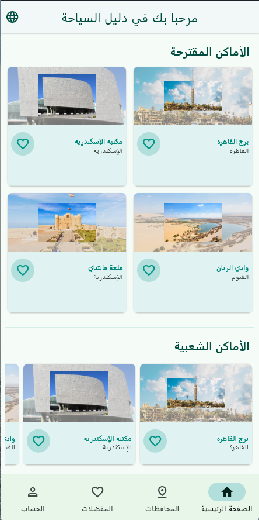

Tourist Guide App for Egypt
===========================

Project General Description
---------------------------

A mobile application for tourists visiting Egypt to explore landmarks, museums, and other attractions across different Egyptian governorates. The app provides a seamless experience for users to discover popular and suggested places, manage their profiles, and save their favorite destinations.

Features
--------

1.  **Authentication**:
    
    *   **Sign-Up Page**: Allows new users to create an account with email, password, and other details.
        
    *   **Login Page**: Enables existing users to log in using their credentials.
        
    *   **Logout**: Users can log out from their accounts.
        
2.  **Home Page**:
    
    *   Displays **suggested places** and **popular places** in Egypt.
        
    *   Users can load more places dynamically.
        
    *   Each place can be added to or removed from favorites.
        
3.  **Governorates Page**:
    
    *   Lists all Egyptian governorates.
        
    *   Users can explore landmarks within each governorate.
        
    *   Detailed information about each landmark is provided, including images, descriptions, and locations.
        
4.  **Profile Page**:
    
    *   Displays user information such as name, email, and password (hashed for security).
        
    *   Users can view their profile details if logged in, or be prompted to log in if not authenticated.
        
5.  **Favorites Page**:
    
    *   Users can view and manage their favorite places.
        
    *   Favorites are stored locally and can be removed from the list.
        
6.  **Bottom Navigation Bar**:
    
    *   Provides easy navigation between the Home, Governorates, Favorites, and Profile pages.
        
7.  **Theme Management**:
    
    *   Users can toggle between **Light** and **Dark** themes.
        
    *   The app's theme is managed using the ThemeBloc.
        
8.  **Localization**:
    
    *   The app supports both **English** and **Arabic** languages.
        
    *   Users can switch between languages using a language dialog.
        
9.  **User Management**:
    
    *   Admins can add, edit, and delete users through the **User Management** section.
        
    *   Users' data is cached locally for offline access.
        
10.  **API Integration**:
    
    *   The app integrates with an external API to fetch user data and manage user profiles.
        

Amazing Design!
---------------

Check out the design on Figma:[Tourist Guide App Design](https://www.figma.com/design/KEjroCCAG4AIkln01XVkbc/Sprints-Tourist-Guide-App?node-id=0-1&t=1opeDcSv2UOy639I-1)

Packages/Classes Used
---------------------

The following packages were used in this project:

*   [**page\_transition**](https://pub.dev/packages/page_transition) (v2.2.1): Adds page transition animations to the application.
    
*   [**easy\_localization**](https://pub.dev/packages/easy_localization) (v3.0.7): Facilitates localization and internationalization of the app.
    
*   [**flutter\_bloc**](https://pub.dev/packages/flutter_bloc): Used for state management across the app.
    
*   [**shared\_preferences**](https://pub.dev/packages/shared_preferences): Used for local storage of user data and preferences.
    
*   [**dio**](https://pub.dev/packages/dio): Used for making HTTP requests to the API.
    

Assets Used
-----------

The project utilizes the following assets:

*   **General Assets Directory**: assets/
    
*   **Images**: assets/images/
    
*   **Translations** for localization:
    
    *   English: assets/translations/en.json
        
    *   Arabic: assets/translations/ar.json
        

Fonts Used
----------

The following custom fonts were used in the project:

1.  **PlaywriteAUSA**:
    
    *   Regular Style: fonts/PlaywriteAUSA/PlaywriteAUSA-Regular.ttf
        
2.  **Bitter**:
    
    *   Regular Style: fonts/Bitter/Bitter-Regular.ttf
        

For details on how to add or customize these assets and fonts, refer to the [Flutter documentation](https://flutter.dev/docs/development/ui/assets-and-images).

Example Demo
------------

Example Output
--------------

Code Structure
--------------

The project is structured into several key directories and files:

*   **Blocs**: Contains the business logic and state management for authentication, places, profile, and theme.
    
    *   auth\_bloc.dart: Manages user authentication state.
        
    *   places\_bloc.dart: Handles loading and managing places data.
        
    *   profile\_bloc.dart: Manages user profile data.
        
    *   theme\_bloc.dart: Handles theme switching between light and dark modes.
        
*   **Controllers**: Contains the logic for fetching data from local JSON files or APIs.
    
    *   governorate\_controller.dart: Fetches governorate data.
        
    *   places\_controller.dart: Fetches places data.
        
*   **Models**: Contains the data models used in the app.
    
    *   governorate\_model.dart: Represents a governorate and its landmarks.
        
    *   landmark\_model.dart: Represents a landmark.
        
    *   place\_model.dart: Represents a place (used in the home page).
        
    *   user.dart: Represents a user.
        
*   **Views**: Contains the UI components and pages.
    
    *   login\_page.dart: The login page.
        
    *   signup\_page.dart: The sign-up page.
        
    *   home\_page.dart: The home page displaying suggested and popular places.
        
    *   government\_page.dart: The page displaying governorates and their landmarks.
        
    *   profile.dart: The user profile page.
        
    *   favourites\_page.dart: The page displaying user's favorite places.
        
    *   userlist.dart: The page for managing users (admin feature).
        
*   **Widgets**: Contains reusable UI components.
    
    *   app\_drawer.dart: The app's navigation drawer.
        
    *   grid\_item.dart: A grid item for displaying places.
        
    *   lang\_dialog.dart: A dialog for switching languages.
        
    *   my\_textformfield.dart: A custom text form field widget.
        
    *   text\_title.dart: A custom text widget for titles.
        
*   **Services**: Contains services for API interactions and caching.
    
    *   api\_service.dart: Handles API requests for user data.
        
    *   user\_cache.dart: Manages local caching of user data.
        

How to Run the Project
----------------------

1.  Clone the repository.
    
2.  Run flutter pub get to install dependencies.
    
3.  Ensure you have the necessary assets and translations in the assets/ directory.
    
4.  Run the app using flutter run.
    

Future Enhancements
-------------------

*   **Search Functionality**: Add a search bar to easily find places or landmarks.
    
*   **Offline Mode**: Enhance the app to work offline by caching more data locally.
    
*   **User Reviews**: Allow users to leave reviews and ratings for places.
        

Contributing
------------

Feel free to contribute to this project by opening issues or submitting pull requests. Your contributions are welcome!

License
-------

This project is licensed under the MIT License. See the [LICENSE](https://github.com/Sprints-Flutter-Bootcamp-Projects/Tourist-Guide-App-for-Egypt/blob/authentication/LICENSE) file for details.
