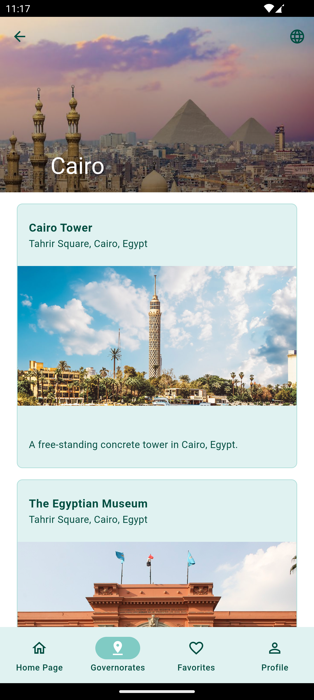

<em>This project is part of the Flutter Bootcamp from Sprints and ACC</em>
### Flutter Fundamentals - Project
# Tourist Guide App for Egypt

 

## Project General Description

A mobile application for tourists visiting Egypt to explore landmarks, museums, and other attractions across different Egyptian governorates

## Features
1. Sign-Up page
2. Login page
3. Home Page
4. Governments Page
5. Profile Page
6. Bottom Navigation Bar
7. Favorites Page

### Amazing Design!
https://www.figma.com/design/KEjroCCAG4AIkln01XVkbc/Sprints-Tourist-Guide-App?node-id=0-1&t=1opeDcSv2UOy639I-1 

## Example Output

